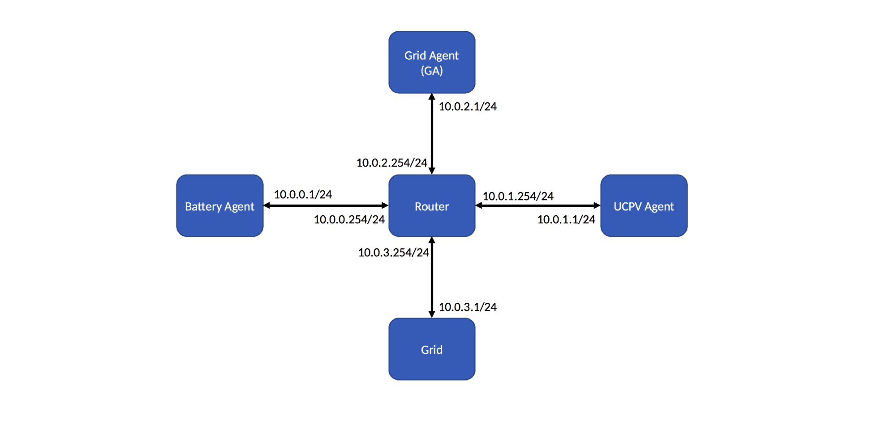

# T-RECS

## Introduction

T-RECS is a software testbed for multi-agent real-time control of
electric grids.  T-RECS uses software containers to run each agent
in a virtual environment.  Agents are networked via Mininet, so real
packets are exchanged using TCP/IP.

## INSTALL
Installation instructions are present in `install/INSTALL.md` file.

## Sign Convention for Power
In T-RECS, power demand (load) is taken as negative whereas power
generation is positive.

## Usage

Simulation is done via the `runtestbed.py` script.

```
usage: runtestbed.py host_config_path grid_config_path resource_config_path
					 sensor_config_path network_config_path
					 [-h] [--output_path OUTPUT_PATH]
                     [--time_limit TIME_LIMIT]
                     [--model_listen_port MODEL_LISTEN_PORT]
                     [--agent_listen_port AGENT_LISTEN_PORT]

Run the T-RECS testbed.

positional arguments:
  host_config_path      path to the host configuration file
  grid_config_path      path to the grid configuration file
  resource_config_path  path to the resource configuratoin file
  sensor_config_path    path to the sensor configuration file
  network_config_path   path to the network configuration file

optional arguments:
  -h, --help            show this help message and exit
  --output_path OUTPUT_PATH
                        directory to write output to
  --time_limit TIME_LIMIT
                        maximum time to run the simulation for
  --model_listen_port MODEL_LISTEN_PORT
  						the port on localhost where model listens for messages from the agent
  --agent_listen_port AGENT_LISTEN_PORT
  						the port on localhost where agent listens for messages from the model
```

The five positional arguments, `host_config_path`,
`grid_config_path`, `resource_config_path`, `sensor_config_path`,
and `network_config_path` are mandatory.  They are described in
[the following section](#configuration-format).

## Configuration format

All configuration files are written in JSON.

1. The *host configuration* describes the number of hosts to run. It 	contains information about the executables that will be run on 	each host. In case of COMMELEC agents, we have two kinds of 	agents: a resource agent (RA) and a grid agent (GA). In case the 	agent is of type RA, we also need to tell the resource it 	controls.
2. The *resource configuration* describes the resources and their
   configuration parameters.
3. The *grid configuration* describes the grid: the buses and the
   branches, as well as the resources attached to the buses.
4. The *sensor configuration* describes the buses for which we need
   the measurements and where to send them.
5. The *network configuration* describes the network.  At the 	moment, it only contains the network loss for each link in the 	TCP/IP communication.

### Host configuration

The host configuration contains one entry for each host/agent.  
The entry consists of:

```javascript
{
	"host_name": string,                      // Name of the agent.
	"host_type": "RA", or "GA",
	"attached_resource_name": string          // Only relevant if "type" == "RA".
	"executables": [
		{
			"executable_path": string         // Relative path to the executable.
			"command_line_arguments": string  // Arguments to the executable.
			"required_files_paths": string    // Other files that should be present.
		},
		...  // More "exec" entries.
	]
}
```

### Grid configuration

The grid configuration contains information about the grid.  It consists of:

```javascript
{
	"lines": [
		{
			"from": int  // From which bus.
			"to": int    // To which bus.
			"R": float   // Resistance.
			"X": float   // Reactance.
			"B": float   // Susceptance.
		},
		...  // More "lines" entries.
	],
	"base_quantities": {  // Base quantities of the grid.
		"V": float,
		"S": float
	},
	"slack_voltage": [
		{
			"use_trace": boolean           // Define if trace is used for slack voltage
			"trace_file_path": 1, 2, or 3  // Relative path to the trace
			"voltage_real": float          // Default real value if trace is not used
			"voltage_imaginary": float     //  Default imaginary value if trace is not used.
		}
	],
	"resources": [
		{
			"resource_name": string               // Resource name.
			"resource_type": "battery" or "ucpv"  // Resource type.
			"bus_index": int                      // On which bus is the resource.
		},
		...  // More "resources" entries.
	]
}
```

### Resource configuration

The resource configuration contains information about resources.  
It consists of:

```javascript
{
    "resources": [
		{        // Config files for ucpv and ucload are somewhat similar and presented below:
			"resource_name": string               // Name of the resource
			"irradiance_trace_file_path": string  // Only for ucpv, trace of irradiance (in W/m2)
			"trace_file_path": string             // Only for ucload, trace of S (in kVA)
			"update_period": float                // For both ucpv and ucload, the period with which we update the agent
			"sample_period": float                // For ucload, the period with wich we read from trace file
			"rated_power_dc_side": float          // Only for ucpv, ratted power in W (power produce by the ucpv when irradiance is S_STC W/m2)
			"S_STC": float                        // Only for ucpv,  STC for standard test condition)
			"converter_efficiency": float         // Only for ucpv
			"comments": string                    // If any
		}
		...
		// Currently, T-RECS supports three resource models: ucpv, ucload, and battery.
		// Configuration parameters for battery are different and are available in
		// sample ressource config file.
    ]
}

```

### Sensor configuration

The sensor configuration contains information about the sensor.  It
consists of:

```javascript
{
		"sensed_bus_indices": list,         // Which buses to sense.
        "sensed_info_sending_freq": float,  // At what period to sense and send (in milli seconds).
		"receivers_of_sensed_info": [
			{
				"host_name": string,  // name of the receiver.
				"listen_port": int    // Port of the receiver.
    	}
		],
		"line_frequency":{
			"use_trace": boolean        // Define if trace is used for line frequency
			"trace_file_path": string,  // Relative path to the line frequency trace
			"line_frequency": float	 // Default line frequency value if trace is not used
		}
	"comments": string // If any
}
```

### Network configuration

The network configuration contains information about the network.  It consists of:

```javascript
{
    "loss": float  // Percentage loss per link on TCP/IP communication.
}
```

In the future, we will be looking to extend the network configuration
to include a configurable network topology as well as a per-link loss
and delay.

## Resource models

For the time being, T-RECS supports three types of resources:
*batteries*, *Uncontrollable PVs*, and *Uncontrollable loads*.  
Batteries either consume (charge) or generate (discharge) power,
while PVs only generate power and loads only consume power.

All models can be parameterized in resource configuration.

Uncontrollable PV reads its irradiance whereas uncontrollable load
reads its apparent power (S) from a trace file. This trace file is specified
in ressource configuration file. In case of uncontrollable load, as it
reads the apparent power from the trace file, the power factor needs to be
specified in the configuration file.

## Network topology and communication model

In order to use T-RECS, ideally, one must provide their own network topology
but currently, this feature is not available. Currently, the grid and agents are
connected and communicate via a host router.  They are assigned IP
addresses of the form `10.x.y.1`, where `x.y` is determined by the way they
appear in the agent configuration. First host: x = 0, y = 0; Second host: x = 0, y = 1; 255th host: x = 0, y = 254; 256th host: x = 1, y = 0; and so on.
Grid host is created by the T-RECS itself and is the last one. It is assigned the ip after assigning the ip to other hosts from host configuration file.


Consider the sample host configuration provided in the `sample/conf` directory.
It specifies two resource agents, and a grid agent, in the following order:
1. Battery resource agent;
2. Uncontrolled PV resource agent (commelec); and
3. Grid agent (commelec).

Thus, the agents are going to be assigned the following IP addresses:
1. Battery RA: 10.0.0.1
2. Uncontrolled PV RA: 10.0.1.1
3. GA: 10.0.2.1
4. Grid: 10.0.3.1

It is important to remind ourselves that the resource agents communicate
to their resource models (running in the same host) using localhost communication.
Thus, if an RA needs to send messages to its corresponding model, it needs
to send the message to (`127.0.0.1`, `34343`).
For the messages from resource models to the RAs, it needs to send the message
to (`127.0.0.1`, `43434`). Regarding the ports, these are the default values but
can also be specified by the user while running the runtestbed.py script of T-RECS.

**The case of our running example**

Local communication looks like the following:
* battery RA ----> its model: battery RA will send to (`127.0.0.1`, 34343)
* Uncontrolled PV RA ----> its model: UCPV RA will send to (`127.0.0.1`, 34343)

For listening the messages from their models,
* battery RA will listen on (`127.0.0.1`, 43434)
* UCPV RA will listen on (`127.0.0.1`, 43434)

Real communication looks like the following:
* battery RA -----> GA: battery RA will send to (`10.0.2.1`, PORT\_WHERE\_GA\_IS\_LISTENING\_FOR\_MESSAGES\_FROM\_RAS)
* UCPV RA -----> GA: UCPV RA will send to (`10.0.2.1`, PORT\_WHERE\_GA\_IS\_LISTENING\_FOR\_MESSAGES\_FROM\_RAS)
* GA -----> battery RA: GA will send to (`10.0.0.1`, PORT\_WHERE\_BATTERY\_RA\_IS\_LISTENING\_FOR\_MESSAGES\_FROM\_GA)
* GA -----> UCPV RA:    GA will send to (`10.0.1.1`, PORT\_WHERE\_UCPV\_RA\_IS\_LISTENING\_FOR\_MESSAGES\_FROM\_GA)
* GridSensor  -----> GA: GridSensor will send to (`10.0.2.1`, PORT\_WHERE\_GA\_IS\_LISTENING\_FOR\_MESSAGES\_FROM\_SENSORS)

In case of our sample scenario, below figure presents how the network structure looks like:




Sample run of T-RECS (before running the below command, get the same executables from [the repo, link coming soon.]):

```
lca2@SG01:~/trecs$ sudo ./src/runtestbed.py ./sample/conf/host_config.json ./sample/conf/grid_config.json ./sample/conf/resource_config.json ./sample/conf/sensor_config.json ./sample/conf/network_config.json --output_path=output
```

## Directory structure

```
├── README.md
├── src
	└──	runtestbed.py
	└──	model
    	└──	 grid
	 			└──	singlephase
				 	└──	singlephasegrid.py
				└──	threephase
					└──	threephasegrid.py
    	└── resource
				└──	battery
					└──	battery.py
				└──	cload
					└──	cload.py
				└──	ucload
					└──	ucload.py
				└──	cpv
					└──	cpv.py
				└──	ucpv
					└──	ucpv.py
				└──	evcs
					└──	evcs.py
					└──	ev.py
	└──	module
		└──	gridmodule.py
		└──	sensormodule.py
	└──	api
		└──	gridapi.py
	└──	router
		└──	sniff.py
		└──	schema.capnp
	└──	util
		└──	snippets.py
	├── plot
		└── plot.py
├── sample
	└── agent
	   	└── batt1_ra
				└──	battery-agent-v1.0
				└──	commelecd
				└──	agent-config.json
				└── config-files			
					└── battery-model-parameters.json
					└──	daemon-cfg.json
					└── ra-res-config.json
			└── ucpv1_ra
				└──	ucpv-agent-v1.0
				└──	commelecd
				└──	daemon-cfg.json
   		└── ugrid_ga
				└──	ugrid_ga
				└──	gaconfig.json
				└──	requestVPP.dat
	└── conf
		└── host_config.json
		└── grid_config.json
		└── resource_config.json
		└── network_config.json
		└── sensor_config.json
	└── trace
		└── irradiance_trace.csv
		└── line_frequency.csv
		└── slack_voltage.csv
├── install
	└── INSTALL
	└── pip_list.txt
	└── install.sh
```

* `src` contains all the T-RECS source code.
* `src/model` contains the grid and resource models.
* `src/module` contains the *grid module* (which operates the grid), the
  *grid sensor* (which sends the state of the grid to a given receiver).
* `src/api` contains the GridAPI that the outside world uses to either
  implement a setpoint on the grid or ask for the grid's state.
* `src/router` contains the scapy script to capture the traffic at the router.
* `src/util` contains `snippets.py`, a file with utility functions.
* `src/plot` contains `plot.py`, a script to plot various output data.
* `sample/agent` should contain executables of your agents.  In the running scenario, `ugrid_ga` is the COMMELEC
  grid agent, `batt1_ra` is the COMMELEC battery RA, and `ucpv1_ra` is the PV RA. They are not provided with MIT license as part of the T-RECS source code. [GridSteer](https://www.gridsteer.ch) provides sample executables at this [repo](link coming). 
* `sample/conf` contains the sample configuration files for a scenario having
  one GA and two resource agents, namely Battery and Uncontrollable PV agents.
* `sample/trace` contains trace files. Currently, it contains the weather
  trace used by UCPV model.
* `install` contains the bash script to install T-RECS dependencies.

At runtime,`output` (or whatever is specified via the `--output_path` switch)
directory is created in the directory from where you ran the T-RECS. This
directory will contain the standard output and standard error of the executables.
In this directory, the `csv` directory contains CSV files written by the executables
themselves. This directory is deleted, if already exists, and created each time T-RECS is run.

Moreover, in the T-RECS root directory, `run` directory will be created to store files
temporarily and run them for current T-RECS execution. This directory is deleted, if
already exists, and created each time T-RECS is run.

## Plotting the results

The `plot.py` script can be used to plot the results of the execution of `runtestbed.py`.

```
usage: plot.py GA grid_bus grid_line
				[-h] [--slack SLACK] [--batteries [battery [battery ...]]]
                [--ucpvs [ucpv [ucpv ...]]]

Plot output generated by `runtestbed.py`.

positional arguments:
  GA                    Path to the GA's (commelec) log file
  grid_bus              Path to the grid's bus log file
  grid_line             Path to the grid's line log file

optional arguments:
  -h, --help            show this help message and exit
  --slack SLACK         Index of the slack bus
  --batteries [battery [battery ...]]
                        Path to the batteries' log files
  --ucpvs [battery [battery ...]]
                        Path to the UCPVs' log files
```

It expects as input the path to commelec's output, the CSV file
generated by `gridmodule.py` (default `output/csv/grid_bus.csv`, and `output/csv/grid_line.csv`),
and any CSV files generated by batteries and UCPVs (e.g., `output/csv/battery.csv` and
`output/csv/ucpv.csv`).  

An example invocation is (assuming `output` is the name of the directory
where user directs the output and log file):

```
lca2@SG01:~/Desktop/shared/c4science_projects/t-recs$ ./src/plot/plot.py ./output/ugrid_ga/ugrid_ga.out ./output/csv/grid_bus.csv ./output/csv/grid_line.csv
--batteries ./output/csv/battery1.csv
--ucpvs ./output/csv/ucpv1.csv
```
